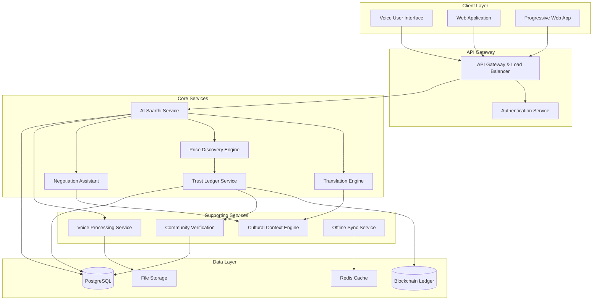

# Design Document: Multilingual Mandi – AI Saarthi

## Overview

The Multilingual Mandi – AI Saarthi platform is a voice-first web application designed to revolutionize local trade in Indian mandis by providing AI-powered language translation, fair pricing discovery, and negotiation assistance. The system addresses the unique challenges of semi-literate users, poor connectivity, and complex multilingual trade environments through an intelligent, culturally-aware AI assistant.

The platform employs a microservices architecture with offline-first capabilities, ensuring reliable operation in rural environments with intermittent connectivity. The core AI Saarthi assistant integrates natural language processing, speech recognition, cultural context understanding, and blockchain-inspired trust mechanisms to create a comprehensive trading support system.

## Architecture

### High-Level Architecture



### Service Architecture Patterns

**Microservices with Event-Driven Communication**: Each core service operates independently with asynchronous event communication for scalability and resilience.

**Offline-First Design**: Critical services cache data locally and synchronize when connectivity is available, ensuring continuous operation in rural environments.

**AI Service Orchestration**: The AI Saarthi service acts as an intelligent orchestrator, coordinating between translation, pricing, and negotiation services based on conversation context.

## Components and Interfaces

### AI Saarthi Service

**Purpose**: Central AI assistant that orchestrates all user interactions and provides intelligent responses.

**Key Interfaces**:
```typescript
interface AISaarthiService {
  processVoiceInput(audioData: AudioBuffer, userId: string, context: ConversationContext): Promise<SaarthiResponse>
  handleTextInput(text: string, language: string, userId: string): Promise<SaarthiResponse>
  updateConversationContext(sessionId: string, context: ConversationContext): Promise<void>
  getPersonalizedRecommendations(userId: string, tradeContext: TradeContext): Promise<Recommendation[]>
}

interface SaarthiResponse {
  audioResponse?: AudioBuffer
  textResponse: string
  visualCues: VisualIndicator[]
  actionSuggestions: ActionSuggestion[]
  confidenceLevel: number
}
```

**Core Capabilities**:
- Natural language understanding across 15+ Indian languages
- Context-aware conversation management
- Integration with all platform services
- Personalized response generation based on user history

### Translation Engine

**Purpose**: Provides real-time, context-aware translation between Indian regional languages.

**Key Interfaces**:
```typescript
interface TranslationEngine {
  translateText(text: string, sourceLang: string, targetLang: string): Promise<TranslationResult>
  translateVoice(audioData: AudioBuffer, sourceLang: string, targetLang: string): Promise<VoiceTranslationResult>
  detectLanguage(input: string | AudioBuffer): Promise<LanguageDetection>
  handleCodeSwitching(mixedLanguageInput: string): Promise<TranslationResult>
}

interface TranslationResult {
  translatedText: string
  confidence: number
  alternatives?: string[]
  culturalNotes?: string
}
```

**Advanced Features**:
- Code-switching detection and handling
- Cultural context preservation
- Trade-specific terminology recognition
- Confidence scoring and alternative suggestions

### Price Discovery Engine

**Purpose**: Analyzes local transaction data to provide fair, transparent pricing recommendations.

**Key Interfaces**:
```typescript
interface PriceDiscoveryEngine {
  getPriceRecommendation(product: ProductInfo, location: Location): Promise<PriceRecommendation>
  analyzeFairness(proposedPrice: number, product: ProductInfo, context: TradeContext): Promise<FairnessAnalysis>
  getHistoricalTrends(product: ProductInfo, timeRange: TimeRange): Promise<PriceTrend[]>
  updateMarketData(transaction: Transaction): Promise<void>
}

interface PriceRecommendation {
  suggestedPrice: number
  priceRange: { min: number, max: number }
  fairnessIndicator: 'green' | 'yellow' | 'red'
  supportingData: TransactionSummary[]
  confidence: number
}
```

**Intelligence Features**:
- Seasonal pattern recognition
- Quality-adjusted pricing
- Local market condition analysis
- Real-time fairness assessment

### Trust Ledger Service

**Purpose**: Maintains transparent, tamper-proof records of local transactions and vendor reputation.

**Key Interfaces**:
```typescript
interface TrustLedgerService {
  recordTransaction(transaction: Transaction): Promise<LedgerEntry>
  verifyTransaction(transactionId: string): Promise<VerificationResult>
  getVendorReputation(vendorId: string): Promise<ReputationScore>
  queryLocalTransactions(criteria: QueryCriteria): Promise<TransactionSummary[]>
  flagSuspiciousActivity(pattern: SuspiciousPattern): Promise<void>
}

interface LedgerEntry {
  transactionId: string
  timestamp: Date
  parties: { buyer: string, seller: string }
  product: ProductInfo
  price: number
  location: Location
  cryptographicHash: string
}
```

**Trust Mechanisms**:
- Cryptographic transaction verification
- Community-based validation
- Reputation scoring algorithms
- Fraud detection and prevention

### Voice Processing Service

**Purpose**: Handles speech-to-text, text-to-speech, and voice quality optimization for multilingual audio.

**Key Interfaces**:
```typescript
interface VoiceProcessingService {
  speechToText(audioData: AudioBuffer, language: string): Promise<SpeechResult>
  textToSpeech(text: string, language: string, voiceProfile: VoiceProfile): Promise<AudioBuffer>
  enhanceAudioQuality(audioData: AudioBuffer): Promise<AudioBuffer>
  detectSpeakerEmotion(audioData: AudioBuffer): Promise<EmotionAnalysis>
}

interface SpeechResult {
  transcription: string
  confidence: number
  detectedLanguage: string
  audioQuality: QualityMetrics
}
```

**Audio Processing Features**:
- Noise reduction for market environments
- Multi-language speech recognition
- Emotion and tone detection
- Voice profile customization

### Cultural Context Engine

**Purpose**: Provides cultural intelligence for appropriate communication and negotiation strategies.

**Key Interfaces**:
```typescript
interface CulturalContextEngine {
  getRegionalContext(location: Location): Promise<RegionalContext>
  adaptCommunicationStyle(message: string, culturalContext: CulturalContext): Promise<string>
  getNegotiationGuidance(context: NegotiationContext): Promise<CulturalGuidance>
  getSeasonalFactors(location: Location, date: Date): Promise<SeasonalContext>
}

interface RegionalContext {
  preferredGreetings: string[]
  negotiationStyle: NegotiationStyle
  culturalTaboos: string[]
  seasonalPatterns: SeasonalPattern[]
  localCustoms: CustomInfo[]
}
```

**Cultural Intelligence**:
- Regional communication preferences
- Festival and seasonal awareness
- Negotiation style adaptation
- Local custom integration

## Data Models

### Core Entity Models

```typescript
// User and Vendor Models
interface Vendor {
  id: string
  name: string
  languages: string[]
  location: Location
  specialties: ProductCategory[]
  reputationScore: number
  verificationStatus: VerificationStatus
  culturalProfile: CulturalProfile
}

interface CulturalProfile {
  region: string
  preferredLanguages: string[]
  communicationStyle: CommunicationStyle
  negotiationPreferences: NegotiationPreferences
}

// Transaction and Trade Models
interface Transaction {
  id: string
  buyerId: string
  sellerId: string
  product: ProductInfo
  agreedPrice: number
  quantity: number
  timestamp: Date
  location: Location
  status: TransactionStatus
  culturalContext: CulturalContext
}

interface ProductInfo {
  category: ProductCategory
  name: string
  quality: QualityGrade
  unit: MeasurementUnit
  seasonality: SeasonalityInfo
  localNames: Map<string, string> // language -> local name
}

// AI and Context Models
interface ConversationContext {
  sessionId: string
  participants: Participant[]
  currentTopic: TradeTopicType
  negotiationPhase: NegotiationPhase
  culturalContext: CulturalContext
  priceContext: PriceContext
  history: ConversationTurn[]
}

interface TradeContext {
  product: ProductInfo
  quantity: number
  location: Location
  timeOfYear: Date
  marketConditions: MarketConditions
  participantProfiles: VendorProfile[]
}

// Trust and Verification Models
interface ReputationScore {
  overall: number
  reliability: number
  fairness: number
  communication: number
  transactionCount: number
  communityEndorsements: number
  lastUpdated: Date
}

interface VerificationStatus {
  isVerified: boolean
  verificationMethod: VerificationMethod
  endorsements: CommunityEndorsement[]
  trustLevel: TrustLevel
}
```

### Offline Data Models

```typescript
// Offline-capable models for low connectivity scenarios
interface OfflineCache {
  userId: string
  cachedTranslations: Map<string, TranslationResult>
  recentPriceData: PriceDataSnapshot[]
  essentialVendorInfo: VendorSummary[]
  culturalGuidelines: CulturalGuideline[]
  lastSyncTimestamp: Date
}

interface SyncQueue {
  pendingTransactions: Transaction[]
  pendingMessages: Message[]
  pendingReputationUpdates: ReputationUpdate[]
  conflictResolutionData: ConflictData[]
}
```

Now I need to use the prework tool to analyze the acceptance criteria before writing the correctness properties:

<function_calls>
<invoke name="prework">
<parameter name="featureName">multilingual-mandi

## Correctness Properties

*A property is a characteristic or behavior that should hold true across all valid executions of a system—essentially, a formal statement about what the system should do. Properties serve as the bridge between human-readable specifications and machine-verifiable correctness guarantees.*

### Property 1: AI Saarthi Response Language Consistency
*For any* voice input in a supported regional language, AI Saarthi should respond in the same language within 2 seconds, maintaining conversation context throughout the trade session.
**Validates: Requirements 1.1, 1.5**

### Property 2: Multi-language Code-switching Handling
*For any* conversation containing mixed languages (code-switching), the Translation Engine should correctly identify language boundaries and provide appropriate translations while preserving speaker tone and intent.
**Validates: Requirements 1.2, 9.2, 9.3**

### Property 3: Trade Terminology Recognition
*For any* trade-specific terminology or local expression in supported languages, AI Saarthi should demonstrate correct understanding and provide culturally appropriate responses.
**Validates: Requirements 1.3, 7.5**

### Property 4: Audio Quality Error Handling
*For any* degraded or unclear audio input, AI Saarthi should detect the quality issue and request clarification using simple, culturally appropriate language for the user's region.
**Validates: Requirements 1.4, 7.2**

### Property 5: Transaction Recording Completeness
*For any* completed transaction, the Trust Ledger should record all required details (timestamp, parties, price, product information) with cryptographic verification to prevent tampering.
**Validates: Requirements 2.1, 2.4**

### Property 6: Privacy-Preserving Transparency
*For any* Trust Ledger query, the system should provide accessible transaction data while protecting individual privacy through appropriate anonymization techniques.
**Validates: Requirements 2.2, 10.5**

### Property 7: Local Transaction Relevance
*For any* price verification request, the Trust Ledger should return only transactions that are relevant to the local area and similar product categories.
**Validates: Requirements 2.3**

### Property 8: Suspicious Activity Detection
*For any* transaction pattern that meets suspicious activity criteria, the Trust Ledger should automatically flag it for community review without manual intervention.
**Validates: Requirements 2.5, 8.3**

### Property 9: Voice Interface Fallback
*For any* scenario where voice input is unavailable, the platform should provide functionally equivalent touch-based alternatives with clear visual indicators.
**Validates: Requirements 3.2**

### Property 10: Price Fairness Color Coding
*For any* price display, the Fairness Indicator should show green for fair prices, yellow for questionable prices, and red for potentially unfair prices based on local transaction data.
**Validates: Requirements 3.4, 4.4**

### Property 11: Audio Feedback Completeness
*For any* user action or system confirmation, the platform should provide appropriate audio feedback to support voice-first interaction.
**Validates: Requirements 3.5**

### Property 12: Price Discovery Response Time
*For any* pricing request, the Price Discovery Engine should analyze recent local transactions and provide fair price ranges within 3 seconds, including confidence levels and supporting data.
**Validates: Requirements 4.1, 4.3**

### Property 13: Contextual Price Analysis
*For any* price recommendation, the Price Discovery Engine should consider seasonal patterns, product quality, and local market conditions specific to the mandi location.
**Validates: Requirements 4.2, 7.4**

### Property 14: Data Scarcity Handling
*For any* pricing request where insufficient local data exists, the Price Discovery Engine should clearly indicate this limitation and provide regional estimates as fallback.
**Validates: Requirements 4.5**

### Property 15: Silent Negotiation Privacy
*For any* active negotiation, the Silent Negotiation Mode should provide guidance through private visual cues or audio without revealing strategy to the counterpart.
**Validates: Requirements 5.1, 5.2**

### Property 16: Cultural Negotiation Adaptation
*For any* negotiation context, AI Saarthi should consider cultural norms and patterns specific to the participants' regions and languages when providing guidance.
**Validates: Requirements 5.3, 7.2**

### Property 17: Impasse Resolution
*For any* negotiation that reaches an impasse (defined by lack of progress over specified time/rounds), AI Saarthi should suggest compromise solutions privately to help break the deadlock.
**Validates: Requirements 5.4**

### Property 18: Negotiation Learning
*For any* completed negotiation, the platform should analyze the outcome and successful patterns to improve future guidance for similar contexts.
**Validates: Requirements 5.5**

### Property 19: Offline Feature Availability
*For any* network disconnection scenario, the Low Connectivity Mode should maintain access to essential cached features while clearly indicating which features require connectivity.
**Validates: Requirements 6.1, 6.4**

### Property 20: Offline-Online Synchronization
*For any* offline transactions or voice interactions, the platform should automatically synchronize with the Trust Ledger and process queued data when connectivity is restored.
**Validates: Requirements 6.2, 6.5**

### Property 21: Network Optimization
*For any* slow network conditions, the platform should prioritize critical data transfer and apply compression to maintain functionality.
**Validates: Requirements 6.3**

### Property 22: Cultural Context Adaptation
*For any* recommendation or communication, the Cultural Context Engine should adapt based on local festivals, harvest seasons, regional customs, and appropriate measurement units.
**Validates: Requirements 7.1, 7.3**

### Property 23: Community Verification Requirements
*For any* new vendor registration, the Community Verification system should require endorsement from existing trusted members before granting full platform access.
**Validates: Requirements 8.1**

### Property 24: Reputation Tracking Accuracy
*For any* vendor, the platform should accurately track reliability through completed transactions and community feedback, displaying current verification status and trust scores.
**Validates: Requirements 8.2, 8.4**

### Property 25: Dispute Mediation Process
*For any* dispute that arises between vendors, the Community Verification system should provide mediation through trusted community members with appropriate escalation procedures.
**Validates: Requirements 8.5**

### Property 26: Language Support Coverage
*For any* of the 15 major supported Indian languages (Hindi, English, Tamil, Telugu, Bengali, Marathi, Gujarati, Kannada, Malayalam, Punjabi, Odia, Assamese, Urdu, Bhojpuri, Rajasthani), the Translation Engine should provide functional translation capability.
**Validates: Requirements 9.1**

### Property 27: Translation Uncertainty Handling
*For any* translation with low confidence, the Translation Engine should request clarification or offer alternative translations rather than providing potentially incorrect results.
**Validates: Requirements 9.4**

### Property 28: Translation Learning Improvement
*For any* user correction to a translation, the platform should incorporate this feedback to improve future translation accuracy for similar contexts.
**Validates: Requirements 9.5**

### Property 29: Communication Encryption
*For any* voice communication or transaction data, the platform should apply industry-standard encryption protocols to ensure security and privacy.
**Validates: Requirements 10.1**

### Property 30: Multi-modal Authentication
*For any* user authentication attempt, the platform should provide suitable options for semi-literate users including voice recognition, PIN, and biometric methods.
**Validates: Requirements 10.3**

### Property 31: Security Threat Response
*For any* detected suspicious activity, the platform should alert affected users and implement appropriate protective measures automatically.
**Validates: Requirements 10.4**

## Error Handling

### Voice Processing Errors
- **Audio Quality Issues**: When speech recognition confidence falls below 70%, request clarification using simple language
- **Language Detection Failures**: Provide language selection interface with audio prompts in common regional languages
- **Network Interruptions**: Cache voice inputs locally and process when connectivity returns

### Translation Errors
- **Ambiguous Translations**: Present multiple options with confidence scores when translation uncertainty is high
- **Unsupported Language Pairs**: Gracefully fallback to supported languages with user notification
- **Cultural Context Mismatches**: Flag potential cultural sensitivity issues and request human review

### Price Discovery Errors
- **Insufficient Data**: Clearly communicate data limitations and provide best-effort regional estimates
- **Market Volatility**: Alert users when price recommendations may be affected by unusual market conditions
- **Calculation Failures**: Provide fallback pricing based on historical averages with appropriate disclaimers

### Trust Ledger Errors
- **Synchronization Conflicts**: Implement conflict resolution protocols prioritizing cryptographic verification
- **Fraud Detection**: Automatically flag suspicious patterns while allowing community review and appeals
- **Data Integrity Issues**: Maintain backup verification mechanisms and audit trails

### Offline Mode Errors
- **Storage Limitations**: Prioritize essential data and provide clear storage management options
- **Sync Failures**: Implement retry mechanisms with exponential backoff and user notification
- **Feature Degradation**: Clearly communicate reduced functionality and estimated restoration times

## Testing Strategy

### Dual Testing Approach

The Multilingual Mandi platform requires comprehensive testing through both unit tests and property-based tests to ensure correctness across the complex multilingual, multicultural environment.

**Unit Testing Focus**:
- Specific examples of cultural communication patterns
- Edge cases in voice processing (background noise, accents, dialects)
- Integration points between AI services
- Error conditions and fallback mechanisms
- Authentication flows for different user literacy levels

**Property-Based Testing Focus**:
- Universal properties across all supported languages and regions
- Comprehensive input coverage through randomized test generation
- Cultural context variations and seasonal pattern handling
- Trust ledger integrity across different transaction patterns
- Offline-online synchronization scenarios

### Property-Based Testing Configuration

**Testing Framework**: Use Hypothesis (Python) or fast-check (TypeScript/JavaScript) for property-based testing
**Minimum Iterations**: 100 iterations per property test to account for randomization across languages, regions, and cultural contexts
**Test Tagging**: Each property test must reference its design document property using the format:
**Feature: multilingual-mandi, Property {number}: {property_text}**

### Specialized Testing Requirements

**Multilingual Testing**:
- Generate test data across all 15 supported languages
- Include code-switching scenarios common in Indian conversations
- Test cultural context preservation across language boundaries

**Cultural Context Testing**:
- Simulate different regional festivals and seasonal patterns
- Test negotiation guidance across various cultural contexts
- Verify appropriate measurement units and currency handling

**Voice Processing Testing**:
- Test with various audio qualities and background noise levels
- Include different accents and speaking speeds
- Verify emotion and tone preservation in translations

**Trust and Security Testing**:
- Test cryptographic verification under various attack scenarios
- Verify privacy preservation while maintaining transparency
- Test community verification workflows and dispute resolution

**Offline Capability Testing**:
- Test all offline scenarios with various connectivity patterns
- Verify data synchronization integrity after network restoration
- Test storage limitations and data prioritization algorithms

Each correctness property must be implemented as a single property-based test that validates the universal behavior across all valid inputs, with minimum 100 iterations to ensure comprehensive coverage of the multilingual, multicultural trading environment.